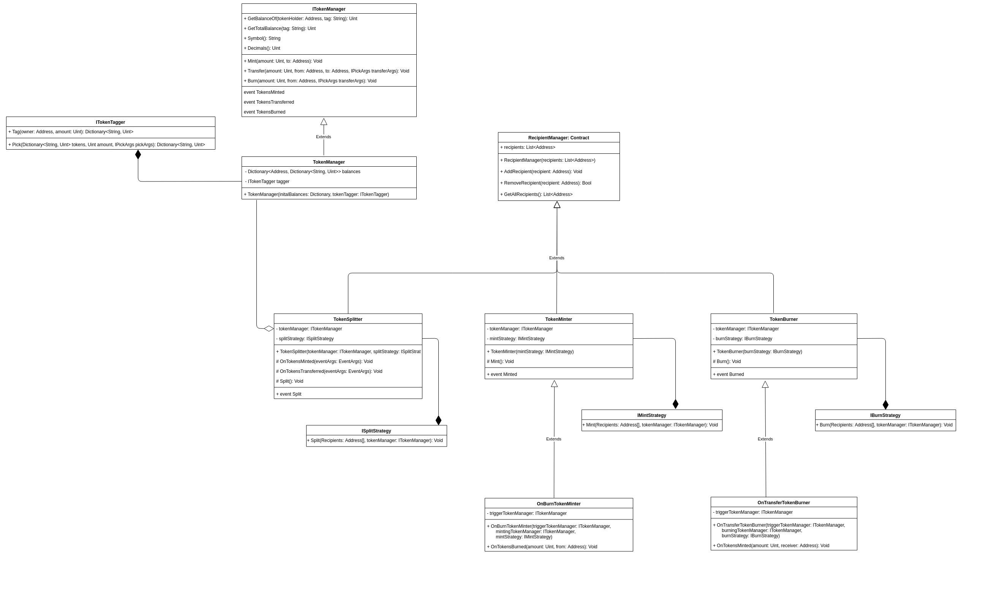
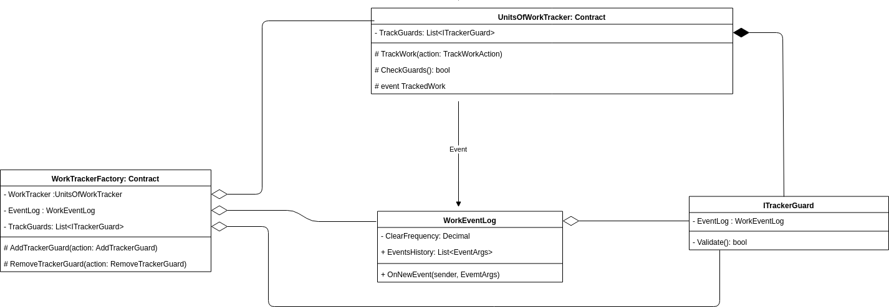
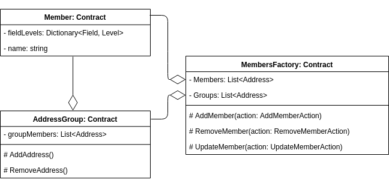

  

___

 Work with each other, not for one another

 

Wetonomy platform lays the basis of a completely new way of running an organization. It goes beyond just the idea of balancing capital & labour and could open up a new level of organizational engagement. 
Through Wetonomy people can collaborate, share profit, fund ideas and reward contributions with a level of trust and automation that was impossible prior to blockchain technology.

 

## Architecture

### Blockchain basis and smart contracts
Wetonomy steps on [StrongForce](https://github.com/comrade-coop/strongforce) - a .Net based Smart Contracts framework over Tendermint Consensus. StrongForce provides an engine for writing your own contracts in dotnet, enables message forwarding and control over the addresses that have the permissions to execute a particular action. 
[Tendermint](https://tendermint.com/) Consensus ensures that transactions will be recorded in the same order in every machine. [Cosmos SDK](https://cosmos.network/) presents the ability to scale up immensely through different blockchains and create "Internet of Blockchains". 

### Token Flow
Token Flow section handles minting and burning of tokens, splitting them depending on the strategy chosen and through the addresses having earned them. 

  

### Units of Work
Units of Work section takes care of rewarding each member with the amount of tokens he/she earned. 

  

### Members
Each instance of Wetonomy has members and groups with unique addresses. Each of them is a Contract that may or may not have permissions to execute an action.

  

The whole UML of the architecture can be found [here](images/architecture.png).

### Status

